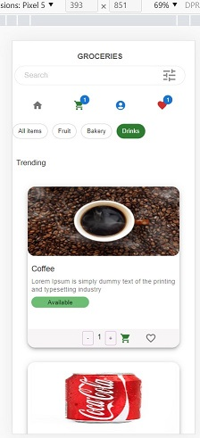

# demo-grocery-app

### How to run the project?

### Library used

1. React (18.2)
2. Redux (state management library)
3. Redux-toolkit (state management library)
4. Material ui
5. Typescript
6. Jest (testing library)
7. es-lint
8. Prettier
9. husky

### Features

1. Add to favorites/whishlist
2. Add to cart
3. cart page
4. Favorite page
5. Catalog Search
6. Catalog filter

### Technical Features

1. Completely responsive in all break points - xs, sm, md, xl
2. React latest version 18.2
3. State management using Redux
4. React build is using esbuild (fastest)
5. Typescript
6. Jest test

### Mobile view

### Desktop view

